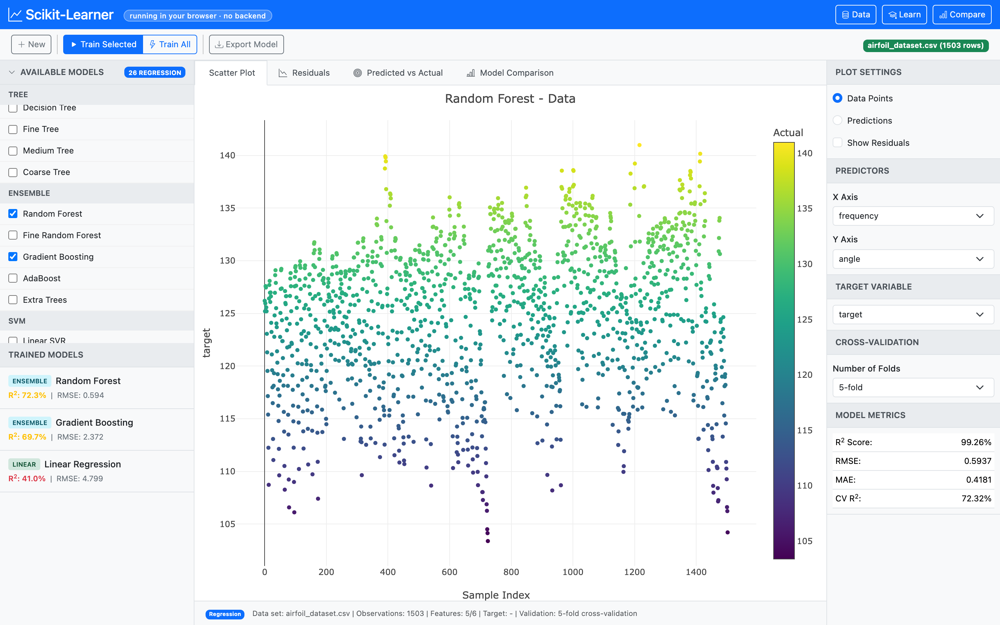

# Scikit-Learner 📈

A web-based machine learning application for training and comparing regression and classification models. **This runs scikit-learn directly in the user's browser via [Pyodide](https://pyodide.org/), so the whole app deploys as a static website.**



## Features

- **27 Regression Models** across 6 categories
- **22 Classification Models** across 6 categories
- **Interactive Plotly visualizations** — scatter, residuals, predicted vs actual, ROC, confusion matrix, comparison bar chart
- **Cross-Validation** (3 / 5 / 10 folds)
- **Sample Datasets** — Iris, Wine, Breast Cancer, Digits (classification); Diabetes, Boston-synthetic, Airfoil, Synthetic (regression)
- **Model Export** — joblib bytes, single-file or zipped bundle

## How it works

```
┌───────────────────────────────────────────────────────────┐
│  Browser                                                  │
│  ┌─────────────────────────────────────────────────────┐  │
│  │  index.html + Bootstrap + Plotly                    │  │
│  │  ↓ pyCall('train', [...])                           │  │
│  │  ┌────────────────────────────────────────────────┐ │  │
│  │  │  pyodide-bridge.js                             │ │  │
│  │  │  • loads Pyodide from JSDelivr CDN             │ │  │
│  │  │  • installs scikit-learn / pandas / numpy /    │ │  │
│  │  │    scipy / joblib                              │ │  │
│  │  │  • runs frontend/py/learner.py inside Pyodide  │ │  │
│  │  │  • thin pyCall / pyCallBinary wrappers         │ │  │
│  │  └────────────────────────────────────────────────┘ │  │
│  └─────────────────────────────────────────────────────┘  │
└───────────────────────────────────────────────────────────┘
                  (no network calls after first load)
```

First load: ~10 s (downloads Pyodide runtime + sklearn wheel, ~15 MB total).
Subsequent loads: ~1 s thanks to browser cache.

## Running locally

This is a 100% static site — no Python virtualenv, no Node toolchain, no backend to start. Any static file server will do; the snippet below uses Python's stdlib server only because it's universally available.

```bash
python3 -m http.server -d frontend 8080
open http://localhost:8080/
```

Edit any file under `frontend/` and reload the browser.

If you change `frontend/py/learner.py`, the browser fetches it fresh on reload — but Pyodide doesn't pick up the change until the module is re-imported. Hard-reload (Cmd-Shift-R / Ctrl-F5) or open a new tab.

## Deploy

Upload `frontend/` to any static host (Netlify, GitHub Pages, S3, …).

## Testing

A Playwright end-to-end spec covers Pyodide bootstrap, sample loading, training, predictions, export, and the UI scatter-plot render — 8 assertions, runs against either a local `python -m http.server -d frontend` or the public URL.

## Caveats (WASM)

- Pyodide initial load adds ~10 s and ~15 MB of one-time download. Loading overlay covers it.
- CSV upload capped at 20 MB (Pyodide's WASM heap).
- The `airfoil` dataset is bundled as `frontend/data/airfoil.csv` because Pyodide can't reach `fetch_openml` from inside the browser.
- Boston-housing uses the synthetic generator (real Boston was removed from sklearn ≥1.2).

## License

BSD