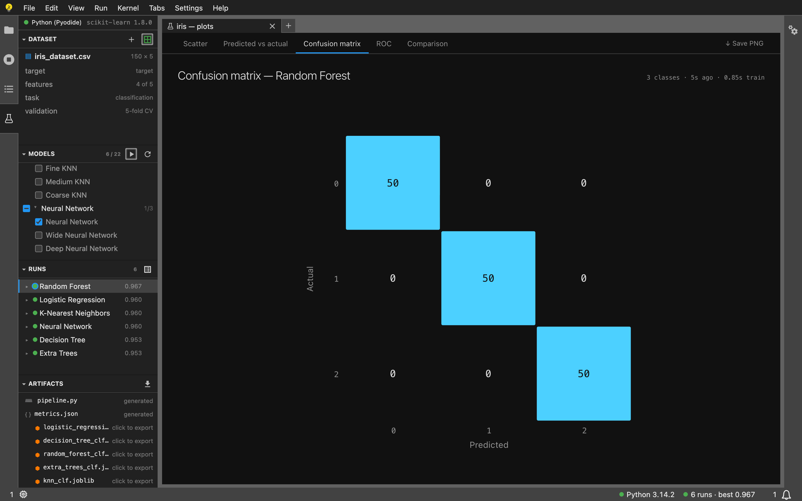
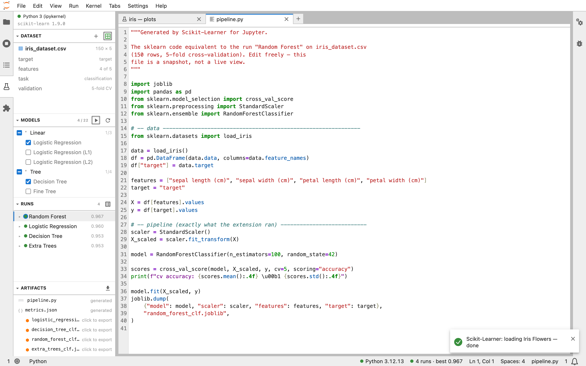
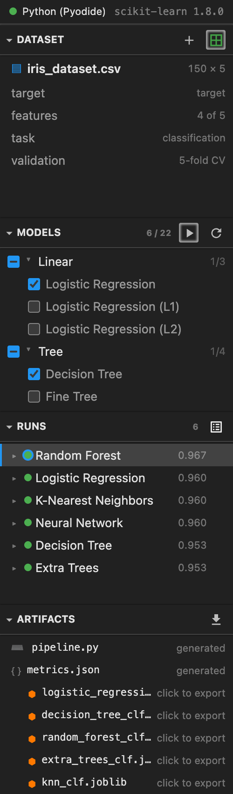

# scikit-learner-jupyter

Train and compare scikit-learn models from a side panel, in JupyterLab 4 and
JupyterLite.

**Try it with nothing installed: [jupyter.scikit-learner.app](https://jupyter.scikit-learner.app)**
— a full JupyterLite, so the Python is Pyodide in your browser and no data
leaves the machine.



Six models fitted against iris in the browser, ranked best-first, with the
confusion matrix for the winner. Everything in that screenshot is live: Pyodide
booted, `piplite` fetched scikit-learn, and the models were actually trained.

In JupyterLab the kernel is your own Python, and the generated `pipeline.py`
opens as a real editor tab next to the plots:



The panel on its own. Category rows carry the tri-state a tree view would give
you for free, runs sort best-first as they land, and each finished run gets a
`.joblib` in ARTIFACTS:



## Where it came from

This is the third shell over one ML layer. The
[web app](../frontend) runs `learner.py` in Pyodide; the
[VS Code extension](../vscode-extension) execs it in a subprocess and talks
line-delimited JSON over stdio; this execs it **inside the notebook kernel**
and talks over IOPub. `learner.py` itself is byte-identical in all three —
`scripts/gen-assets.mjs` pulls it out of `../frontend` at build time, the same
single-source rule the PyPI wheel follows with `force-include`.

## The UX, and where it came from

The VS Code extension is a sidebar of four tree views plus a plots editor.
This is the same product in Jupyter's furniture:

| VS Code | JupyterLab / JupyterLite |
|---|---|
| Activity-bar container with four tree views | A `SidePanel` in the left area with four accordion sections |
| DATASET / MODELS / RUNS / ARTIFACTS | The same four, same order, same rows |
| `view/title` actions (+, ▶, ⟳, 📈) | Section toolbars, which the accordion renders into the headers |
| Tree checkboxes on models | Real checkboxes, including the category tri-state |
| Plots editor (a webview) | A tab holding an iframe — running `webview/plots.js` **verbatim** |
| Status bar: Python, then training progress | Two `IStatusBar` items, same order |
| Command palette drives everything | Same: every click resolves to a command id |
| `pipeline.py` / `metrics.json` virtual documents | Real files, written to the contents manager and opened |
| Save dialog for a `.joblib` | A contents-manager write; the file browser can download it |
| "Select Python interpreter…" | "Select the kernel to fit models in…" |
| "Set up local Python environment" | "Install missing packages into the kernel" |
| "Restart Python runtime" (kills the subprocess) | "Restart the kernel" |

Two commands exist here and not there — "Install missing packages into the
kernel" and "Save plot" — and both are consequences of a kernel not being a
subprocess. Two exist there and not here: `setupEnvironment` and
`removeEnvironment` provision a private virtualenv, which has no meaning when
the environment is a kernelspec somebody else manages. See the header comment
in `src/commands.ts`.

## Lab and Lite are one build, and one code path

Unlike [Skry](https://github.com/yanndebray/skry), whose JupyterLite build has
to fall back to a hosted API because torch cannot run in Pyodide, **there is no
Lab/Lite split here**. scikit-learn, pandas, scipy and joblib all exist as
Pyodide wheels, so models are fitted in the kernel in both runtimes and your
data never leaves the machine in either.

There is one deliberate behavioural difference. **"Train all models" is absent
in JupyterLite**, because Pyodide is single-threaded and on this tab's main
thread: fitting the whole 22-model catalogue there stops the page responding
for minutes with nothing to cancel. In JupyterLab the fitting happens in a
kernel process, where it is merely slow. `src/runtimeKind.ts` decides, and both
the toolbar button and the command registration are guarded on it — so in Lite
the command palette does not offer it either. Ticking every model and pressing
**Train selected** is still possible, exactly as it is in the web app.

The other difference is who installs the packages:

| | JupyterLab | JupyterLite |
|---|---|---|
| Kernel | whatever kernelspec you pick | Pyodide, in the browser |
| Missing packages | `%pip install`, **after you agree** | `piplite.install`, automatically |

A JupyterLab kernel is somebody's real environment, so installing into it is a
decision worth interrupting for; the `autoInstall` setting turns the prompt
off. Pyodide's kernel is per-tab and disposable, and its packages are a
download rather than a change to anything you own, so it just installs.

The kernel is Scikit-Learner's own, not the active notebook's. Adopting
whichever notebook happens to be focused would make the panel's contents change
when you switch tabs, and would put a multi-megabyte dataframe in a namespace
you believe is yours. It is started lazily: opening the panel costs nothing,
and in JupyterLite that matters — the first fit is when Pyodide and
scikit-learn get fetched.

## Install

**Not on PyPI yet**, so there is no `pip install scikit_learner_jupyter`. Take
the wheel from a [release](https://github.com/yanndebray/scikit-learner/releases):

```bash
pip install scikit_learner_jupyter-<version>-py3-none-any.whl
```

Or build it from this directory — see [Develop](#develop) below for the
toolchain, then:

```bash
hatch build -t wheel        # -> dist/scikit_learner_jupyter-*.whl
```

For JupyterLite, install the wheel into the environment you run
`jupyter lite build` in; the `federated_extensions` addon finds it under
`share/jupyter/labextensions` and copies it into the site with no extra
configuration.

Or skip installing altogether and use the hosted build at
<https://jupyter.scikit-learner.app>.

## Settings

Under **Settings ▸ Settings Editor ▸ Scikit-Learner** (plugin id
`scikit-learner-jupyter:plugin`): `kernelName`, `autoInstall`, `cvFolds`,
`outputDir`. See `schema/plugin.json`.

## How the Python gets there

Nothing is pip-installed on the server side, and that is deliberate twice over:
the environment a Jupyter *server* runs in is routinely not the one its
*kernels* run in, so a server-side install would land in the wrong Python — and
JupyterLite has no server to install into at all.

Instead `scripts/gen-assets.mjs` compiles `python/learner_runner.py`,
`../frontend/py/learner.py` and `../frontend/data/airfoil.csv` into
`src/generated/assets.ts`, and `src/runtime.ts` pushes them into the kernel in
four steps:

```
arm     exec learner_runner.py into sys.modules as _sklearner_runner   (~11 kB)
probe   ask it what this Python is and what it is missing              (free)
fix     piplite.install / %pip install, if anything is                 (slow, once)
boot    exec learner.py into a namespace, airfoil.csv written to /tmp  (~120 kB)
```

The order is the point: arming is cheap and proves we can talk to the kernel,
the probe costs nothing, and only once both pass does the big payload go over
the wire. Requests travel base64-encoded inside a one-line cell, so a CSV full
of quotes and newlines has no way out of the string literal; responses come
back as an `application/json` display bundle, which is a real object rather
than a repr that could be truncated.

The strict rule from the other two shells survives here: **stdout is a protocol
and stderr is a log.** sklearn warns freely about convergence; on stdout that
would corrupt a response. Progress lines go to stderr behind a `::` prefix and
show up live in the panel header.

## The plots tab reuses plots.js, it does not port it

`webview/plots.css` and `webview/plots.js` are inlined into an iframe exactly
as the VS Code extension ships them. That file was written for a webview — it
calls `acquireVsCodeApi()`, takes `#app` by id, and reads every colour from a
`--vscode-*` variable — and in an iframe all three assumptions hold again. The
shim is one function; the theme is bridged by copying computed `--jp-*` values
in as `--vscode-*` ones. Rendering it into a Lumino widget's node instead would
have meant forking the file to scope its queries and rename its variables, and
the two copies would have drifted within a release.

JupyterLab has no chart palette — nothing plays the part of VS Code's
`charts.*` tokens, which the bundled "Probabl Dark" theme supplies there — so
the brand palette is carried in `src/plotsWidget.ts` in a light and a dark
version.

## Develop

Verified on macOS with Python 3.12, node 26, JupyterLab 4.6.2 and
jupyterlite-core.

### One-time environment

```bash
uv venv .venv-jupyter --python 3.12
uv pip install --python .venv-jupyter/bin/python \
  'jupyterlab>=4.6,<5' hatch hatch-jupyter-builder hatch-nodejs-version \
  jupyterlite-core jupyterlite-pyodide-kernel editables
source .venv-jupyter/bin/activate
```

`hatch-nodejs-version` is easy to miss and the failure is opaque: this package
takes its version from `package.json`, and without that plugin an install with
`--no-build-isolation` dies with `Unknown version source: nodejs`.

If node ≥ 26 makes `jlpm` and `jupyter labextension list` spew
`Error: Dynamic require of "util" is not supported`, it is because jupyter
builder's bundled `yarn.js` is CommonJS with no `package.json` above it, and
node loads a bare `.js` under a `file://` URL as ESM. One line fixes it:

```bash
echo '{"type":"commonjs"}' > \
  "$(python -c 'import jupyter_builder,os;print(os.path.dirname(jupyter_builder.__file__))')/package.json"
```

### Build

```bash
cd jupyter-extension
npm install
npm run build:lib                           # gen-assets + tsc -> lib/
jupyter-builder build --development True .  # -> scikit_learner_jupyter/labextension/
```

**`@jupyterlab/core-meta` is pinned to an exact `4.6.0`, and that pin is
load-bearing.** The shared-singleton requirements written into
`remoteEntry.js` — the ones a host checks at load time — come from *that*
package's `core.package.json`, not from the `@jupyterlab/*` ranges in
`package.json` and not from the JupyterLab used to build. Left as a caret it
resolves to the newest 4.6.x and records `requiredVersion: "^4.6.2"`, which
JupyterLite 0.8's 4.6.0 core then fails on every page load:

```
Unsatisfied version 4.6.0 from CORE_FEDERATION of shared singleton
module @jupyterlab/application (required ^4.6.2)
```

Nine of those, once per singleton, and the extension still loads — the
requirements are not strict — so it is easy to ship and never notice. Pin to
the *oldest* core you mean to load into and both are satisfied, since a caret
range on 4.6.0 also covers 4.6.2 and 4.7.

The other `@jupyterlab/*` pins are exact for the ordinary reason: npm's
`latest` dist-tag for those packages still points at 4.5.x, so `^4.6.0` is not
the same request as "the 4.6 line".

### Register and run

```bash
uv pip install --python ../.venv-jupyter/bin/python -e . --no-build-isolation
jupyter-builder develop . --overwrite
jupyter labextension list    # must say: scikit-learner-jupyter v0.1.0 enabled OK
jupyter lab
```

`jupyter-builder develop` shells out to `python -m pip` only when the package
is not already installed, so run the editable install first — a uv-created venv
has no `pip` and the fallback fails.

### Watch loop

```bash
npm run watch              # tsc -w
jupyter-builder watch .    # rspack -w
```

Reload the browser after a rebuild; JupyterLab does not hot-reload federated
extensions.

### JupyterLite

```bash
cd lite
jupyter lite build --output-dir _output --contents files
jupyter lite serve --output-dir _output --port 8903
```

`lite/jupyter-lite.json` sets the app name and switches `autoInstall` on. The
extension needs no other Lite-specific configuration — it is discovered from
the venv. `lite/files/airfoil.csv` is copied there by `gen-assets.mjs` so the
file browser has something to open.

## Layout

| Path | |
|---|---|
| `src/types.ts` | the vocabulary — framework-free, imports no JupyterLab |
| `src/session.ts` | the session model, a port of the VS Code extension's `src/session.ts` |
| `src/runtime.ts` | arm / probe / fix / boot, and the request protocol |
| `src/kernel.ts` | `Kernel.IKernelConnection` reduced to what the runtime needs |
| `src/kernelSession.ts` | the `SessionContext` lifecycle — one lazy kernel |
| `src/panel.tsx` | the `SidePanel` and its four sections |
| `src/ui/sections.tsx` | DATASET / MODELS / RUNS / ARTIFACTS |
| `src/commands.ts` | one command per VS Code command |
| `src/plotsWidget.ts` | the iframe and the theme bridge |
| `src/pipeline.ts` | `pipeline.py` and `metrics.json` generation |
| `python/learner_runner.py` | the kernel-side half |
| `scripts/gen-assets.mjs` | everything this package ships but does not own |
